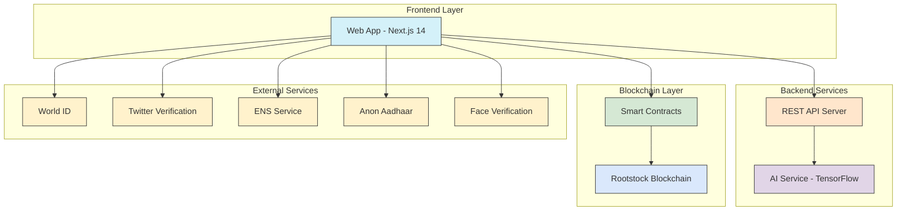
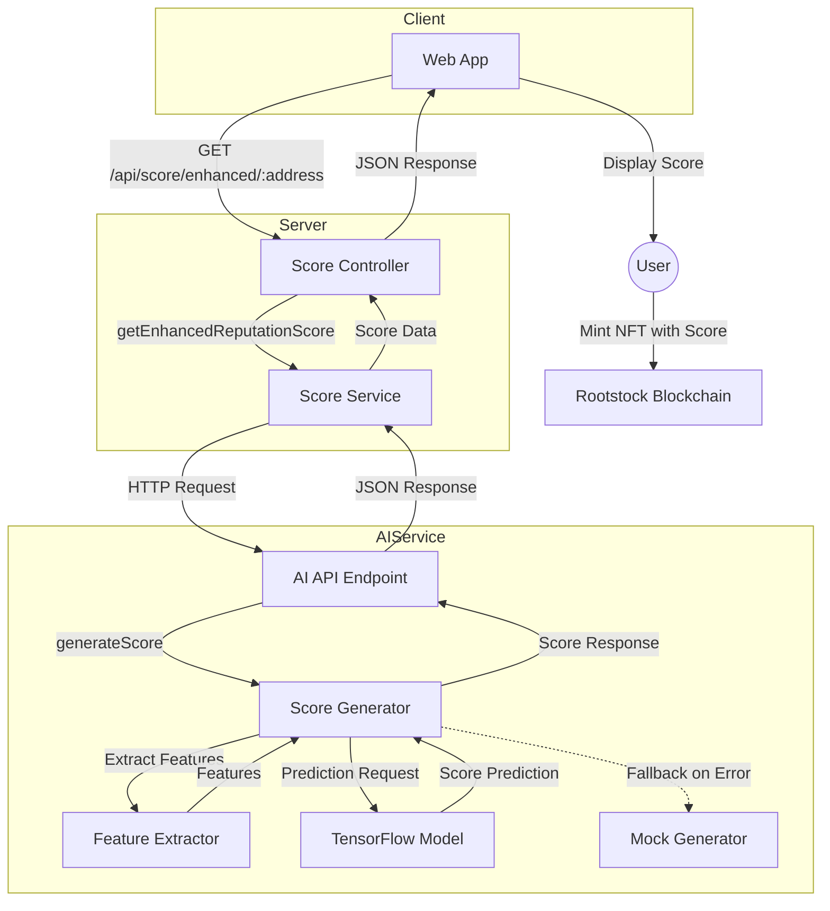

# 🥳 Introduction AgenticID 

AgenticID is a decentralized identity aggregation and verification protocol built on Rootstock blockchain that empowers users with comprehensive identity verification through multiple proof vectors. By leveraging zero-knowledge proofs and tensor AI models, AgenticID creates a privacy-preserving, trustless verification identity that bridges on-chain and off-chain identity elements while keeping user data secure and sovereign.

Our solution addresses the critical need for reliable, privacy-preserving identity in Web3 by combining multiple verification methods: ENS verification, liveness detection, humanity proof via Worldchain, social media verification through TLSNotary, nationality verification using AnonAadhaar, and reputation scoring through advanced AI models—all unified on Rootstock's secure and Bitcoin-backed infrastructure.

## Contracts

AgenticID Contract: [0x419cFe85e77a0A26B9989059057318F59764F7C5](https://explorer.testnet.rootstock.io/address/0x419cFe85e77a0A26B9989059057318F59764F7C5)

Governance Contract: [0x0b3a2D73D07eA2D5D0D0FB4Db09004f74D92767a](https://explorer.testnet.rootstock.io/address/0x0b3a2D73D07eA2D5D0D0FB4Db09004f74D92767a)

## The Problem: Identity Fragmentation in Web3

The blockchain ecosystem suffers from severe identity fragmentation and verification challenges:

- **Trust Gap**: DeFi protocols and DAOs lack reliable mechanisms to verify real human users without compromising privacy
- **Sybil Attacks**: Projects remain vulnerable to manipulation through multiple fake identities
- **Siloed Verification**: Users must repeatedly verify identity across different platforms with no unified solution
- **Privacy vs. Verification Tradeoff**: Current solutions force users to choose between privacy and verifiability
- **Limited Cross-Chain Identity**: Identity systems lack interoperability across blockchain ecosystems
- **Reputation Isolation**: On-chain reputation and credit history remain disconnected and underutilized

This fragmentation creates friction for users, increases costs, and prevents mainstream adoption of Web3 applications.

## Technical Implementation on Rootstock

### Graph


````mermaid
sequenceDiagram
    actor User
    participant WebApp as Web App
    participant Server as API Server
    participant AI as AI Service
    participant ExternalServices as External Verification Services
    participant Blockchain as Rootstock Blockchain

    User->>WebApp: Visit Agentic Identity platform

    Note over User,WebApp: Verification Phase

    User->>WebApp: Connect wallet
    WebApp->>ExternalServices: ENS verification check
    ExternalServices-->>WebApp: ENS verification status

    User->>WebApp: Request face verification
    WebApp->>ExternalServices: Process face verification
    ExternalServices-->>WebApp: Face verification result

    User->>WebApp: Connect with Worldcoin
    WebApp->>ExternalServices: Verify with World ID
    ExternalServices-->>WebApp: Human verification proof

    User->>WebApp: Connect with Anon Aadhaar
    WebApp->>ExternalServices: Verify nationality
    ExternalServices-->>WebApp: Nationality verification proof

    Note over User,AI: Reputation Scoring Phase

    User->>WebApp: Request wallet reputation score
    WebApp->>Server: GET /api/score/enhanced/:walletAddress
    Server->>AI: Request enhanced reputation score
    AI->>AI: Run AI model inference
    AI-->>Server: Return score, confidence & factors
    Server-->>WebApp: Return reputation data
    WebApp-->>User: Display reputation score

    Note over User,Blockchain: NFT Minting Phase

    User->>WebApp: Mint AgenticID NFT
    WebApp->>Blockchain: Call mintAgenticID(...)
    Note right of WebApp: Pass verification flags, nationality, wallet score
    Blockchain-->>WebApp: Return transaction result
    WebApp-->>User: Display NFT minting confirmation

    User->>WebApp: Request identity details
    WebApp->>Blockchain: Call getIdentity(tokenId)
    Blockchain-->>WebApp: Return identity details
    WebApp-->>User: Display identity details
    ```

## Data Flow


