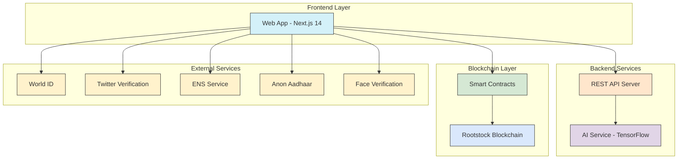

# 🥳 Introduction AgenticID

AgenticID is a decentralized identity aggregation and verification protocol built on Rootstock blockchain that empowers users with comprehensive identity verification through multiple proof vectors. By leveraging zero-knowledge proofs and tensor AI models, AgenticID creates a privacy-preserving, trustless verification identity that bridges on-chain and off-chain identity elements while keeping user data secure and sovereign.

Our solution addresses the critical need for reliable, privacy-preserving identity in Web3 by combining multiple verification methods: ENS verification, liveness detection, humanity proof via Worldchain, social media verification through TLSNotary, nationality verification using AnonAadhaar, and reputation scoring through advanced AI models—all unified on Rootstock's secure and Bitcoin-backed infrastructure.

## Contracts

AgenticID Contract: [0x419cFe85e77a0A26B9989059057318F59764F7C5](https://explorer.testnet.rootstock.io/address/0x419cFe85e77a0A26B9989059057318F59764F7C5)

Governance Contract: [0x0b3a2D73D07eA2D5D0D0FB4Db09004f74D92767a](https://explorer.testnet.rootstock.io/address/0x0b3a2D73D07eA2D5D0D0FB4Db09004f74D92767a)

## The Problem: Identity Fragmentation in Web3

The blockchain ecosystem suffers from severe identity fragmentation and verification challenges:

- **Trust Gap**: DeFi protocols and DAOs lack reliable mechanisms to verify real human users without compromising privacy
- **Sybil Attacks**: Projects remain vulnerable to manipulation through multiple fake identities
- **Siloed Verification**: Users must repeatedly verify identity across different platforms with no unified solution
- **Privacy vs. Verification Tradeoff**: Current solutions force users to choose between privacy and verifiability
- **Limited Cross-Chain Identity**: Identity systems lack interoperability across blockchain ecosystems
- **Reputation Isolation**: On-chain reputation and credit history remain disconnected and underutilized

This fragmentation creates friction for users, increases costs, and prevents mainstream adoption of Web3 applications.

## Technical Implementation on Rootstock

### Graph



````mermaid
sequenceDiagram
    actor User
    participant WebApp as Web App
    participant Server as API Server
    participant AI as AI Service
    participant ExternalServices as External Verification Services
    participant Blockchain as Rootstock Blockchain

    User->>WebApp: Visit Agentic Identity platform

    Note over User,WebApp: Verification Phase

    User->>WebApp: Connect wallet
    WebApp->>ExternalServices: ENS verification check
    ExternalServices-->>WebApp: ENS verification status

    User->>WebApp: Request face verification
    WebApp->>ExternalServices: Process face verification
    ExternalServices-->>WebApp: Face verification result

    User->>WebApp: Connect with Worldcoin
    WebApp->>ExternalServices: Verify with World ID
    ExternalServices-->>WebApp: Human verification proof

    User->>WebApp: Connect with Anon Aadhaar
    WebApp->>ExternalServices: Verify nationality
    ExternalServices-->>WebApp: Nationality verification proof

    Note over User,AI: Reputation Scoring Phase

    User->>WebApp: Request wallet reputation score
    WebApp->>Server: GET /api/score/enhanced/:walletAddress
    Server->>AI: Request enhanced reputation score
    AI->>AI: Run AI model inference
    AI-->>Server: Return score, confidence & factors
    Server-->>WebApp: Return reputation data
    WebApp-->>User: Display reputation score

    Note over User,Blockchain: NFT Minting Phase

    User->>WebApp: Mint AgenticID NFT
    WebApp->>Blockchain: Call mintAgenticID(...)
    Note right of WebApp: Pass verification flags, nationality, wallet score
    Blockchain-->>WebApp: Return transaction result
    WebApp-->>User: Display NFT minting confirmation

    User->>WebApp: Request identity details
    WebApp->>Blockchain: Call getIdentity(tokenId)
    Blockchain-->>WebApp: Return identity details
    WebApp-->>User: Display identity details
    ```


```mermaid
flowchart TD
    subgraph Client
        WebApp[Web App]
    end

    subgraph Server
        APIController[Score Controller]
        ScoreService[Score Service]
    end

    subgraph AIService
        AIEndpoint[AI API Endpoint]
        ScoreGenerator[Score Generator]
        FeatureExtractor[Feature Extractor]
        Model[TensorFlow Model]
        MockGen[Mock Generator]
    end

    WebApp-->|GET /api/score/enhanced/:address|APIController
    APIController-->|getEnhancedReputationScore|ScoreService
    ScoreService-->|HTTP Request|AIEndpoint
    AIEndpoint-->|generateScore|ScoreGenerator

    ScoreGenerator-->|Extract Features|FeatureExtractor
    FeatureExtractor-->|Features|ScoreGenerator
    ScoreGenerator-->|Prediction Request|Model
    Model-->|Score Prediction|ScoreGenerator

    %% Fallback path
    ScoreGenerator-.->|Fallback on Error|MockGen

    ScoreGenerator-->|Score Response|AIEndpoint
    AIEndpoint-->|JSON Response|ScoreService
    ScoreService-->|Score Data|APIController
    APIController-->|JSON Response|WebApp

    WebApp-->|Display Score|User((User))
    User-->|Mint NFT with Score|Blockchain[Rootstock Blockchain]
````

## Our Solution: AgenticID Framework

AgenticID provides a unified identity verification layer on Rootstock that leverages Bitcoin's security with Ethereum's flexibility. Our solution introduces a comprehensive verification framework through six key components:

### 1. ENS Verification Module

- Cross-chain ENS name resolution and verification
- Secure linking of Rootstock RNS addresses and ENS identities

### 2. Liveness Detection System

- Custom AI model for advanced facial recognition and liveness detection
- Proof of human existence and its liveliness without storing biometric data

### 3. Humanity Verification via Worldchain

- Integration with World ID for Sybil-resistant human verification
- ZK-based proof of humanity verification
- Anonymous proof of unique personhood

### 4. Social Identity Verification (TLSNotary)

- Twitter account verification using TLSNotary for trustless proofs
- ZK-based proof of social identity without revealing account details

### 5. Nationality Verification (AnonAadhaar)

- Anonymous verification of Indian nationality through AnonAadhaar
- Zero-knowledge proofs of government-issued identity ( in future we will add verification for other countries)

### 6. Onchain Reputation

- AI-driven reputation models analyzing on-chain transaction history
- Wallet scoring based on transaction patterns and history
- Credit scoring using TLSNotary to verify off-chain financial data

### 7.Credit Scoring (soon)

- Thinking to bring credit scoring from web2 platform to web3 ecosystem without storing sophisticated credit data of user.

# Technical Implementation on Rootstock

AgenticID leverages Rootstock's unique capabilities as a Bitcoin sidechain with Ethereum Virtual Machine compatibility:

### -Smart Contract Architecture

- Core verification registry deployed on Rootstock
- Mod ular verification contracts for each proof type
- Upgradeable proxy pattern for future enhancements
- Soulbound NFTs based AgenticID representing verified identity of user wallet onchain

### - Zero-Knowledge Infrastructure

- Privacy-preserving proofs using Groth16 and PLONK protocols
- Off-chain proof generation with on-chain verification

### -AI and Machine Learning Components

- Custom ai models for facial recognition and liveness detection
- Reputation scoring tensor algorithms analyzing on-chain transaction patterns ( implemented on ai folder)

### -Data Privacy Architecture

- Zero-knowledge proofs ensure no sensitive data is stored on-chain
- Decentralized storage for encrypted verification artifacts on IPFS

# Market Applications

AgenticID enables revolutionary applications across multiple sectors:

### 1.DeFi

- KYC/AML compliance without privacy compromise
- Credit scoring for under-collateralized lending
- Sybil-resistant governance and airdrops

### 2.DAOs

- One-person-one-vote governance systems
- Quadratic funding with verified unique humans
- Reputation-based contribution recognition

### 3.Enterprise Adoption

- Regulatory compliance with privacy preservation
- B2B identity verification for blockchain applications

### 4.Government Services

- Privacy-preserving public service delivery
- Digital citizenship verification
- Cross-border identity verification ( helping refugees and other unrecognized communities)

# Development Roadmap

### Phase 1: Core Infrastructure (MVP Complete)

- Smart contract deployment on Rootstock testnet
- Integration of initial verification modules (ENS, Liveness)
- Integration of Worldchain, TLSNotary, and AnonAadhaar
- MVP development and deployment to test basic functionalities.

### Phase 2: Expanded Verification (Current - End Q2 2025)

- Development of more complex AI-based reputation scoring model
- UI flow improvement ( better designs)
- Comprehensive testing and security audits

### Phase 3: Mainnet Launch

- Full deployment to Rootstock mainnet
- Developer SDK and API for third-party integration
- Cross-chain identity bridging implementations

### Phase 4: Ecosystem Expansion

- Additional verification vectors
- Enterprise partnership program
- Mobile application development

## Future Vision

AgenticID aims to become the standard for decentralized identity verification and aggregation across the Bitcoin and Ethereum ecosystems by creating a unified, privacy-preserving identity layer.

## 🧪 Getting Started

### Prerequisites

- Node.js 18+ (recommended)
- yarn 4.1
- MetaMask or another Web3 wallet
- Rootstock network configuration

### Repository Setup

1. Clone the repository:

   ```bash
   git clone https://github.com/0xshikhar/AgenticIdentity.git
   cd AgenticIdentity/main
   ```

2. Install root-level dependencies:
   ```bash
   yarn install
   ```

3. Run frontend app:

   ```bash
   yarn run dev:web-app
   ```

### Frontend Setup (Web App)

1. Navigate to web app directory:

   ```bash
   cd main/apps/web-app
   ```

2. Install dependencies:

   ```bash
   yarn install
   ```

3. Create a `.env` file with necessary environment variables:

   ```
   NEXT_PUBLIC_ROOTSTOCK_RPC_URL=https://public-node.testnet.rsk.co
   NEXT_PUBLIC_WALLET_CONNECT_PROJECT_ID=your_wallet_connect_project_id
   ```

4. Run development server:
   ```bash
   yarn dev
   ```

### Backend Server Setup

1. Navigate to server directory:

   ```bash
   cd ../server
   ```

2. Install dependencies:

   ```bash
   bun install
   ```

3. Set up environment configuration:

   ```bash
   cp .env.example .env
   ```
3. Build the server:

   ```bash
   bun run build
   ```

4. Start the server:
   ````bash
   bun run start  ```
   ````

### AI Services Setup

1. Navigate to AI directory:

   ```bash
   cd ../ai
   ```

2. Create a environment: 

   ```bash
   bun install
   ```

3. Run AI services:
   ```bash
   bun run serve
   ```

### Smart Contracts Deployment

1. Navigate to contracts directory:

   ```bash
   cd ../contracts
   ```

2. Install dependencies:

   ```bash
   npm install
   ```

3. Compile contracts:

   ```bash
   npx hardhat compile
   ```

4. Deploy to Rootstock Testnet:
   ```bash
   npx hardhat run scripts/deploy.js --network rskTestnet
   ```

### Connecting to Rootstock Testnet

1. Open MetaMask
2. Add Rootstock Testnet:
   - Network Name: Rootstock Testnet
   - RPC URL: https://public-node.testnet.rsk.co
   - Chain ID: 31
   - Currency Symbol: tRBTC

## 🤝 Contributing

Contributions are welcome! Please follow these steps:

1. Fork the repository
2. Create your feature branch (`git checkout -b feature/AmazingFeature`)
3. Commit your changes (`git commit -m 'Add some AmazingFeature'`)
4. Push to the branch (`git push origin feature/AmazingFeature`)
5. Open a Pull Request

## 📄 License

Distributed under the MIT License. See `LICENSE` for more information.

## 🙏 Acknowledgements

- [Rootstock](https://rootstock.io/) - Bitcoin-powered smart contract platform
- [Alchemy](https://www.alchemy.com/) - Blockchain API and node service
- [World ID](https://worldcoin.org/) - Proof of Humanity
- [TLSNotary](https://tlsnotary.org/) - Trustless Verification
